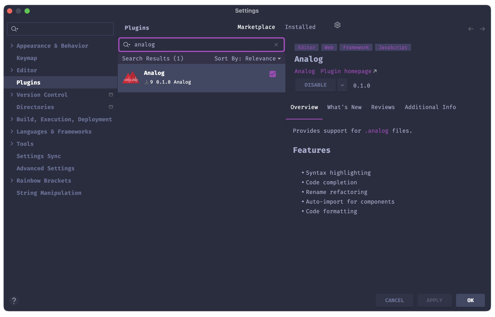

# Analog SFC IDEA Plugin

Provides support for [.analog](https://analogjs.org/) single-file component (SFC) files.

# Features

- Syntax highlighting
- Code completion
- Rename refactoring
- Auto-import for components
- Code formatting

# Pre-requisites

- Requires IDEA Ultimate 2024.1 or WebStorm 2024.1 (EAP version)

# Installation

To install this plugin, either:

1) Install the plugin from [the JetBrains website](https://plugins.jetbrains.com/plugin/23913-analog/) manually
2) In your IDE, go to "Settings," then "Plugins," and search "Analog"

